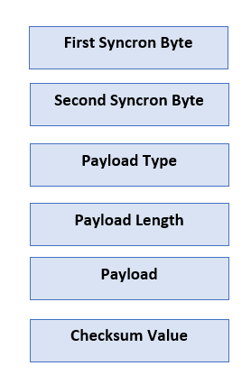
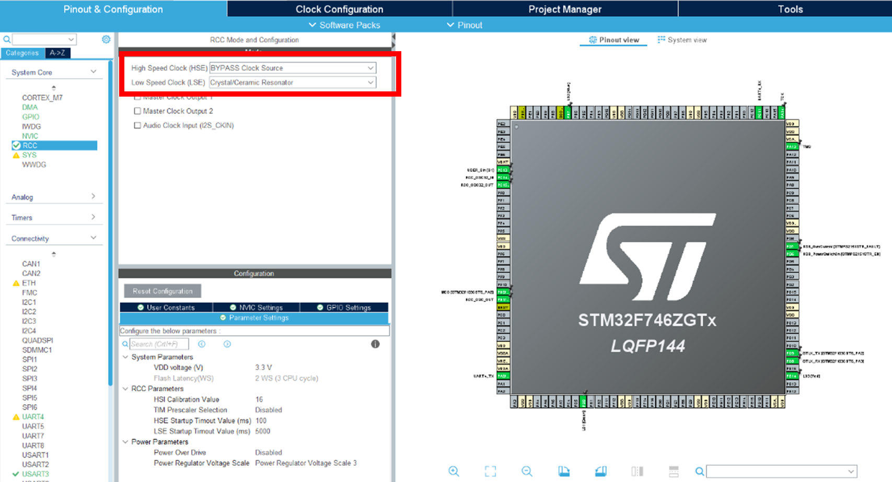
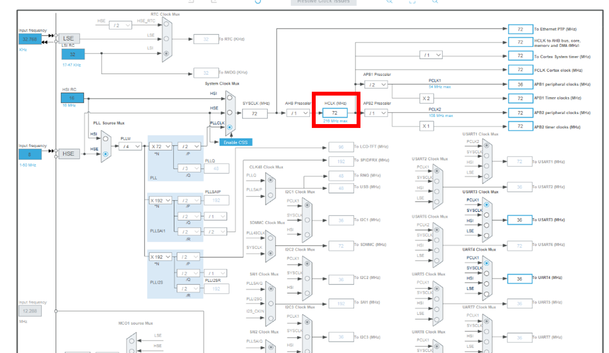
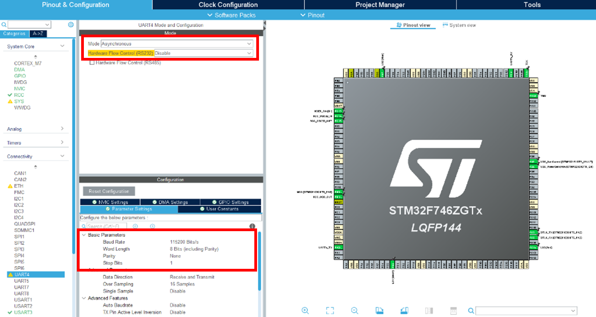
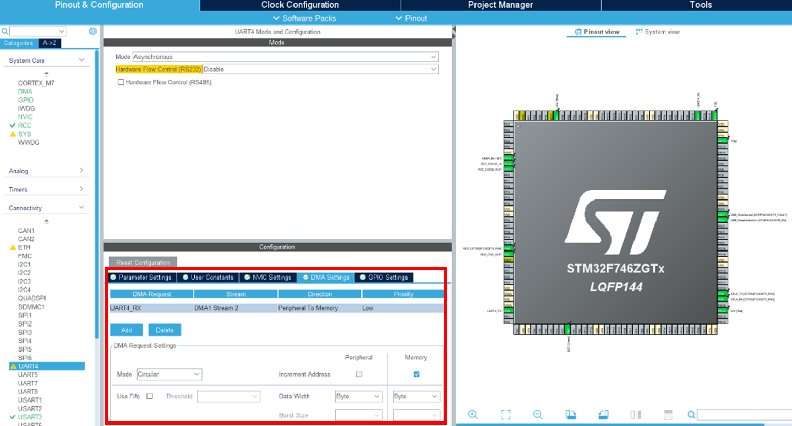
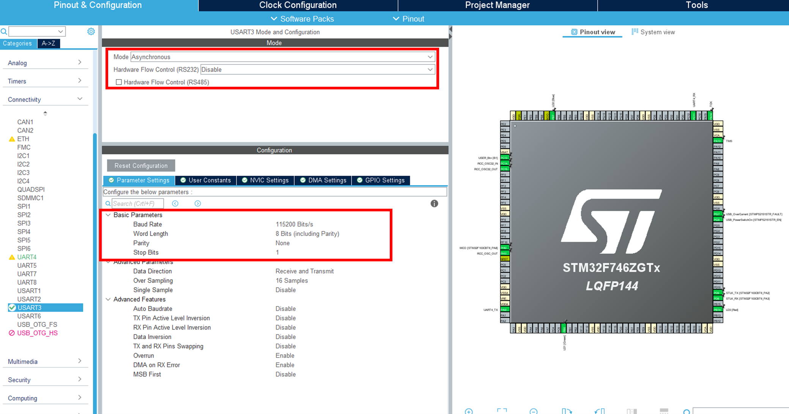
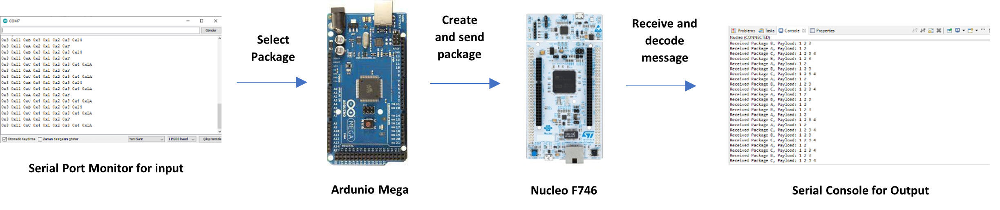
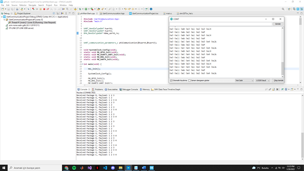

## UART Communication Between Arduino and STM32 | STM32 Nucleo Application Series ##

The aim of this project is to develop a simple communication protocol between
two microprocessors and to provide stable communication over the serial port. In
this project, Arduino Mega was used as transmitter and STM32 F746 Nucleo board
was used as receiver. According to the communication protocol created, the data
is sent to STM from the serial port over the Arduino. In STM, on the other hand,
data is received with DMA and analyzed and interpreted with a state machine
structure. Thus, a stable UART communication is provided between the two
processors.

**Communication Protocol**
<p align="center">
  
</p>


In total, 3 different package structures, named A, B and C, were created
according to this protocol. The protocol's description is as follows:

**First Syncron Byte:** 0x03

**Second Syncron Byte:** 0x11

**Payload Type:** 
    
    package A = 0x0A -> length payload for package A = 2 bytes

    package B = 0x0B -> length payload for package B = 3 bytes

    package C = 0x0C -> length payload for package C = 4 bytes

**Checksum Value:** is 8 bit unsigned integer. For checksum calculation:


```
uint8_t calculate_check_sum(uint8_t *data_array, uint8_t size) {

    uint8_t calculated_CK_u8 = 0;
    for (int i = 2; i < size; i++) {
        calculated_CK_u8 += data_array[i];
        calculated_CK_u8 = calculated_CK_u8 & 0xFF;
    }
    return calculated_CK_u8;
}
```


**Transmit Message via Arduino**

According to the communication structure mentioned above, a structure has been
created in Arduino. According to the input from the Serial Port Monitor, it
sends the relevant message packet to STM over UART1 (Rx1, TX1). The Arduino code
is also shared in the ***/arduino-skecth/*** folder.

**Receive Message with DMA structure in STM**

A total of 2 different uarts are used by stm. These are UART3 and UART4. Message
packets received from Arduino with dma over uart4. Afterwards, the incoming
message with a state machine structure was interpreted and the content of the
incoming packet was sent to a serial console via UART3. For this, adjustments
have been made in the .ioc file as in the image:

**RCC Configuration:** 

<p align="center">
  
</p>


**Clock Configuration:**

<p align="center">
  
</p>


**UART4 Configuration**

<p align="center">
  
</p>


<p align="center">
  
</p>


**UART3 Configuration**
<p align="center">
  
</p>


**General System Diagram **

<p align="center">
  
</p>


**Result**

At the end of the project, the package to be sent from the Arduino serial
monitor is selected and a message packet is created in accordance with the
mentioned communication protocol and a message is sent to STM via UART1. Then,
STM receives the message with DMA structure over UART4, interprets the message
content with state machine structure, and sends the message received to a serial
port over UART3 and the payload of the message over UART3 to the serial console.
The result obtained is shown below:

<p align="center">
  
</p>

